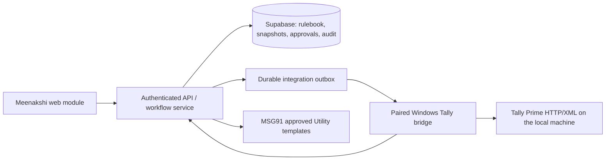

# Meenakshi Group — CD/TOD Implementation Plan

**Status:** Ready for engineering handoff  
**Prepared:** 1 August 2026  
**Scope:** Meenakshi Group only  
**Basis:** `requirement.md`, the Meenakshi v1 Supabase schema drafts, and the Kalika Workflow connector/MSG91 implementation as a technical reference.

## 1. Outcome and delivery boundary

Build a Meenakshi-only Cash Discount (CD) and Turnover Discount (TOD) module that evaluates live Tally evidence, requires Finance approval, creates and verifies the Finance/CA-approved Credit Note treatment in Tally, and then sends eligible WhatsApp communications through MSG91. The intended initial treatment is a commercial no-GST Credit Note, but production rule activation is blocked until that treatment and its effective period are recorded in `company_credit_note_tax_policies`.

This work creates a new Meenakshi workflow. It must not alter the existing Kalika narration-based Cash Discount, Debit Note, Bank Statement, Packet, or Purchase Voucher flows. The Kalika project is a reference for its local Tally bridge, command lifecycle, XML handling, native-PDF path, and MSG91 transport only; its rule logic, tables, Debit Note payload, and UI actions are not reused as business behavior.

The seven Meenakshi migration files in this bundle are deployed once, in timestamp order, as the starting schema. Migration `20260801000250_tally_fact_company_keys.sql` supplies the company-scoped fact keys required by evaluation evidence; `20260801000400_bridge_security_and_workflow_hardening.sql` completes the bridge queue, atomic workflow, tax-policy approval, PDF evidence, lifecycle, and security controls required by this plan. Once deployed, all later schema changes are append-only migrations.

## 2. Target architecture

- The browser reads only its own profile and organization memberships directly. All Meenakshi configuration, accounting data, evaluations, approvals, commands, and messages are accessed through authenticated server APIs. Server authorization is the primary enforcement boundary because the Supabase service role bypasses RLS; every endpoint must independently validate organization, company, role, and record scope. RLS and explicit grants remain defence in depth for browser/Data API access. The service-role key is never exposed to a browser or connector.
- Tally remains the accounting source of truth. Database voucher/master records are traceable live snapshots, never a silent fallback for a requested live evaluation or approval.
- A paired bridge runs on the Windows computer hosting Tally Prime, connects only to the configured local Tally HTTP/XML endpoint, sends heartbeats, claims one durable command at a time, and reports structured success/failure results.
- The API creates outbox work in the same transaction as the relevant workflow state change. A worker dispatches it to the bridge command queue, allowing retries without recreating a business action.
- All business dates are `Asia/Kolkata` dates. Amounts and quantities use database decimals and decimal arithmetic in application code; JavaScript floating-point values must never determine a posted amount.

### 2.1 Kalika reference adoption map

Use the latest Kalika Workflows source only for the following technical patterns. Adapt them to the Meenakshi schema and organization model; do not copy their business implementation wholesale.

| Reuse as a technical reference | Implement separately for Meenakshi | Do not reuse |
| --- | --- | --- |
| Paired Windows bridge installation, token pairing, heartbeat, serial command claiming, stale-claim retry, and local Tally HTTP/XML transport. | Organization/company-scoped connection records, outbox dispatch, master/voucher data contract, source fingerprints, and every Meenakshi command. | Kalika’s per-user `owner_user_id` data ownership and legacy RLS policies. |
| XML escaping, Tally export/import timeout handling, voucher read-back lookup, and verified native PDF delivery pattern. | `sync_meenakshi_masters`, `sync_meenakshi_vouchers`, `fetch_meenakshi_evidence`, `create_credit_note`, verification, and PDF commands. | Narration-based Cash Discount calculations, default day/percentage assumptions, and any inference from ledger balance or narration. |
| Server-side MSG91 approved-template transport and provider-response handling. | Opt-in enforcement, Meenakshi template variables, business-event idempotency, resend audit, and notification persistence. | Debit Note builder, Debit Note approval/recovery routes, legacy Collections tables, and the existing Debit Note UI. |

## 3. Interfaces and command contracts

### 3.1 Server API surface

Create a private Meenakshi API namespace, guarded by organization membership, feature enablement, and the role required for the action.

| Area | Required operations | Authorized role |
| --- | --- | --- |
| Module and Tally scope | enable/check feature, register company, show bridge health, request master/transaction refresh | Administrator |
| Rulebook and calendar | create draft, add immutable version, validate, activate/pause/retire, maintain holidays and contacts/opt-ins | Administrator |
| Evaluation | start CD invoice evaluation, start TOD period evaluation, retrieve result/breakdown, refresh stale proposal | Administrator or Finance approver |
| Review and posting | submit review, approve/reject, retry failed posting with reason, view verified Credit Note | Finance approver; retry also Administrator |
| Messaging | preview approved template, send shortfall reminder, send verified Credit Note notification, audited resend | Administrator or Finance approver |

The API returns user-facing statuses and evidence summaries, not raw bridge command payloads. It must reject cross-organization/company identifiers before reading or mutating any record.

### 3.2 Bridge command set

Extend the reference command lifecycle with Meenakshi-specific commands. Each command contains `companyId`, expected Tally company GUID/name, a business idempotency key, a correlation ID, and only the minimal source/proposal identifiers required by the bridge.

| Command | Bridge responsibility | Completion evidence |
| --- | --- | --- |
| `sync_meenakshi_masters` | Export live customer groups/parents, customer ledgers/contacts, stock groups/items, UOMs, voucher types, and accounting ledgers. | Company identity and source IDs plus counts for each master type. |
| `sync_meenakshi_vouchers` | Export a bounded date/customer/reference scope of sales, receipts, returns, Debit Notes, existing Credit Notes, inventory lines, and bill allocations. Chunk long periods and return a checkpoint/cursor. | Source GUID, Master ID, Alter ID, voucher status, raw payload, and line/allocation totals. |
| `fetch_meenakshi_evidence` | Refresh only the source data needed for a pending CD invoice or TOD customer-period approval. | Fresh fingerprint inputs, current group membership, source voucher state, and duplicate Credit Note matches. |
| `create_credit_note` | First recover a matching existing Tally Credit Note by deterministic reference; otherwise import the approved ledger-mode Credit Note. | Tally import result and provisional voucher identity. |
| `verify_credit_note` | Read the created/recovered voucher back from Tally and compare it to the approved snapshot. | Verified GUID/Master ID, voucher number/date/type, party and discount-ledger entries, amount, reference, company, and raw read-back payload. |
| `export_credit_note_pdf` | Export the already verified Tally Credit Note where the native PDF path supports it. | Valid PDF content, checksum, storage location, and matching voucher identity. |

The bridge must reject a command when its live active company does not exactly match the command’s expected company. It must report an uncertain timeout/import response as unresolved, then run the same deterministic lookup before any retry. A timeout can never be treated as permission to create another voucher.

### 3.3 Tally data contract

Master synchronization must retain Tally GUID, Master ID, Alter ID, availability state, raw payload, and company scope for every selected master. Transaction synchronization must retain the same identifiers plus date, number, type, status, party, taxable product value, ledger entries, inventory lines, bill allocations, and raw payload.

The bridge must specifically distinguish posted sales, receipts, sales returns, Debit Notes, and existing Credit Notes; cancelled, optional, reversed, or altered vouchers must remain identifiable. It must export actual inventory quantity/UOM/value rather than reconstructing quantity from amount and rate. The current Kalika master sync, which returns empty stock items and units, is insufficient and must be replaced for this module.

## 4. Implementation sequence

### Phase 1 — Database deployment and service foundation

1. Provision a clean Supabase environment and apply the seven Meenakshi migrations in timestamp order: `00000`, `00100`, `00200`, `00250`, `00300`, `00400`, then `00500`. Run the schema smoke test before any application feature is enabled. Do not run migration `00400` against a used database without first writing an explicit backfill for existing outbox rows.
2. Generate database types and create a Meenakshi server data-access layer. Every write is organization/company scoped, performed server-side, and emits an `audit_events` row.
3. Add feature gating: only an organization with `meenakshi_discounts` enabled can use the module. Resolve authorization from `organization_memberships`, never from Kalika’s legacy per-user connection ownership.
4. Implement outbox claiming, retry scheduling, dead-letter/error display, and correlation IDs. A retried outbox event records a new attempt but retains the original business idempotency key.
5. Add health/readiness APIs for bridge state, configured company, last sync time, and missing master configuration. No financial action is available while the bridge is stale, Tally is unavailable, or the active company differs.

### Phase 2 — Tally bridge adaptation and live synchronization

1. Reuse the secure pairing, token, heartbeat, serial command execution, timeout handling, and command-result protocol demonstrated by the Kalika bridge. Keep the bridge local to the Tally machine; do not introduce ODBC.
2. Implement XML export builders/parsers for all Meenakshi masters and canonical vouchers. Sync masters atomically per sync run; mark unseen masters unavailable only after a successful full scoped read, never after a partial/failed export.
3. Implement resumable voucher synchronization by date/customer/reference scope. Use narrow evidence refreshes for approval and period chunks for TOD so a financial year does not create browser timeouts.
4. Upsert snapshots with company-scoped identities. Preserve raw XML-derived payloads and source Alter IDs so a later alteration changes the fingerprint.
5. Derive and store a stable fingerprint from the exact relevant company, customer group membership, rule version, calendar revision, source voucher GUID/Master ID/Alter ID/status, inventory lines, and bill allocations. The calculation and approval paths must independently recompute it.
6. Add XML fixtures from a controlled Tally company for all required master and voucher forms, including cancellations, partial receipts, split `Agst Ref` allocations, returns, Debit Notes, existing Credit Notes, and every configured UOM.

### Phase 3 — Rulebook, calendar, contacts, and production setup

1. Build the Rulebook screen over `schemes`, `scheme_versions`, group coverage, stock selections, conversions, tiers, and working calendars. CD and TOD are independently configurable and activatable: either scheme can be enabled without the other. A user edits a draft; editing an active rule creates a new version instead of altering history.
2. Validate activation against a fresh master sync: selected groups and descendants must be available; the Credit Note voucher type must be live; the selected discount ledger must be live and GST `Not Applicable`; CD needs a current calendar; TOD needs stock selection, conversions, and non-overlapping tiers.
3. Surface recursive group coverage in the UI. Activation must reject same-scheme overlapping group coverage for intersecting effective dates; it must not choose a rule by priority.
4. Configure the default Meenakshi calendar as Sunday non-working with client-supplied active holidays. The calendar revision is captured in every CD evaluation; later calendar edits invalidate an unposted evaluation.
5. When a TOD draft selects a live UOM, create immutable built-in conversion rows of `1` tonne for `MT`/`MTS` and `0.001` tonne for `KG`; every other UOM requires an explicitly approved client conversion before activation. A conversion is always stored against the rule version, never inferred at evaluation time.
6. Use only controlled customer contacts. A missing number can be added through the existing controlled update flow, then stored with its source. Store WhatsApp opt-in separately with source, timestamp, and evidence; no opt-in means messaging is unavailable.
7. Load client-supplied groups, rates, tiers, stock selections, conversion factors, ledgers, voucher type, templates, holidays, and opt-ins as configuration data. Do not seed guessed production values in migrations or code.

### Phase 4 — Deterministic evaluator

Implement the evaluator as a pure, independently tested domain module. It accepts a frozen rule version and a normalized live Tally evidence set, produces typed proposal/evaluation records and explanations, and has no HTTP, database, or UI dependency.

**CD evaluation**

1. Select the effective active CD version using live recursive customer-group membership. Customers outside coverage are `Not in scheme`; unavailable/ambiguous membership is `Needs review`.
2. Compute the deadline from the invoice date as Day 0 using only the configured non-working weekdays and active calendar holidays. The default Meenakshi calendar includes Sunday as a configured non-working weekday; Sunday is not hardcoded globally. A receipt on the deadline counts. Store the full counted/excluded-date breakdown.
3. Calculate eligible product taxable value before GST, excluding freight/non-product charges; round only with the rule’s configured method/scale.
4. Aggregate only posted, non-cancelled Receipt voucher allocations of type `Agst Ref` for the exact sales bill reference, on or before the deadline. Do not use narration, On Account, ledger balance, or an unallocated advance.
5. Calculate discounted settlement target, payment by deadline, and shortfall. Generate exactly one CD proposal keyed by company + customer + source sales voucher + rule version.
6. Assign states: `Eligible`, `Near eligibility` when eligible `Agst Ref` payments reach at least **80% of the invoice amount due** but remain below the discounted settlement target, `Partially paid`, `Unpaid`, `Deadline expired`, `Needs review`, or `Already credited`. The 80% threshold is a follow-up trigger only; it never produces a Credit Note.

**TOD evaluation**

1. When a customer-period first enters `Tracking`, resolve and persist its effective TOD rule version. Derive the explicit period start/end from that version’s rule anchor and configured month length. A later rule version applies only to a future customer-period and never rewrites an existing tracked, reviewed, or verified period. Hold results as `Tracking` until the final calendar day has passed; open review on the first working day after closure.
2. Select only live covered customers and eligible stock items/groups. Sum eligible posted sales inventory lines and subtract returns/cancellations. Add a linked Debit Note’s value and quantity only when it has an eligible inventory line with a valid conversion.
3. Convert each eligible source UOM using the approved rule-version conversion. Missing or conflicting conversion blocks that line and the final customer-period proposal; never infer quantity from value/rate.
4. Apply the highest achieved threshold percentage to the full net eligible product taxable value. Show achieved tier, next tier, and remaining tonnes. CD and TOD evaluate independently on the original eligible value.
5. Carry later returns/adjustments that occur after a verified TOD Credit Note into the next open TOD period using explicit prior-period adjustment contributions. Do not mutate the verified prior period.
6. Generate one TOD proposal keyed by company + customer + period start/end + rule version. A matching verified local or recovered Tally Credit Note is `Already credited`.

For both schemes, write an immutable `proposal_evaluations` record, line/voucher/allocation evidence, rule/group/calendar/formula snapshots, reason codes, and a human-readable explanation. Evaluation requests always use a fresh Tally refresh; saved snapshots support audit and display, not live approval decisions.

### Phase 5 — Review, approval, Credit Note posting, and recovery

1. The Evaluation UI provides separate CD and TOD queues, with drill-down evidence: group, rule version, calculations, payments/shortfall or tonnes/tier, source vouchers, validation warnings, and proposed accounting treatment.
2. Before a review can be approved, fetch the relevant live evidence again and recompute the fingerprint. A changed voucher, allocation, membership, rule, calendar, conversion, or duplicate match marks the proposal stale and invalidates its prior review.
3. Require `finance_approver` for approval. The requester cannot approve an item they manually changed after its last live refresh. Rejection, retry, and resend require a reason and are append-only audit events.
4. Create a `credit_note_postings` snapshot from the reviewed evaluation in the same database transaction as Finance approval and the durable outbox event. For the approved commercial no-GST policy, the Tally payload is ledger/accounting mode only: exact Credit Note voucher type, the party ledger credited to reduce the customer receivable, the scheme-specific discount ledger debited as the commercial discount expense, approved amount, narration with rule/version and calculation reference, voucher date equal to approval date, and no stock or CGST/SGST/IGST lines. Validate the required Tally `ISDEEMEDPOSITIVE`/amount representation against the controlled-company fixture rather than copying the Debit Note builder.
5. For CD, use `Agst Ref` while the original invoice remains outstanding; otherwise use a deterministic `New Ref` while retaining the original invoice in the audit snapshot/narration. For TOD, use one deterministic period-level `New Ref`.
6. The bridge creates or recovers the voucher, then performs an independent read-back. Mark `created_verified` only when company, type, party ledger, discount ledger, amount, date, reference, GUID/Master ID, and expected ledger entries match exactly. Failed/mismatched records are `Correction required` or `Failed`, never created.
7. Store every import/read-back attempt, request command payload, safe response snapshot, result, and failure. A recovered pre-existing Tally Credit Note must be linked to the proposal after it passes the same verification, rather than creating another voucher.
8. Queue native PDF export only after read-back verification. Store the PDF checksum/location and voucher linkage. A PDF failure is visible and retryable; it cannot turn an unverified posting into a verified one.

### Phase 6 — MSG91 notifications

1. Maintain approved MSG91 Utility templates per organization/message type. The browser may preview resolved variables but server-side code is the only component that reads the MSG91 secret or sends a message.
2. CD shortfall reminders require a current `Near eligibility` evaluation and opt-in. Populate the customer, paid amount, discount benefit, exact shortfall, and working-day deadline; do not imply that a Credit Note exists.
3. CD/TOD Credit Note notifications require the proposal’s `created_verified` posting and opt-in. Populate the verified voucher number/date, discount amount, CD invoice reference or TOD period/tier/tonnes, and PDF only when a verified PDF exists.
4. Use `notification_messages.business_event_key` for the first send. A resend is a separate audited event with an explicit reason, not a duplicate of the original business event. Persist the request metadata, provider response, recipient, template, attempt, and outcome.
5. MSG91/provider failure leaves the Credit Note verified and the message `failed`/`pending`; it does not re-run Tally posting.

### Phase 7 — User experience, observability, and rollout

1. Add a Meenakshi Collections navigation area with distinct `Cash Discount`, `Turnover Discount`, `Rulebook`, `Credit Notes`, and `Messages` pages. Do not repurpose the legacy Debit Note screen by changing labels.
2. Use the minimum user-facing statuses from the requirements and plain-language next actions. Keep internal command names/XML out of the primary staff interface; make full technical evidence available in audit/detail views.
3. Provide health dashboards for bridge heartbeat, active company mismatch, sync freshness, outbox backlog, failed command/message attempts, missing configuration, and stale proposals. Alerting must identify the company and correlation ID without exposing secrets.
4. Roll out with a Meenakshi test Tally company and test MSG91 template first. Configure production values only after live validation. Run CD/TOD in review-only mode against a selected period, reconcile results with Finance, then enable approvals and production posting. The feature flag remains the immediate rollback control; already verified Credit Notes are never deleted or rewritten.

## 5. Test and acceptance plan

### Automated database and domain tests

- Apply the initial migrations to an empty Supabase/Postgres database and execute the schema smoke test.
- Validate organization RLS: users can read only their own profile/membership; browser access cannot write accounting/configuration tables; cross-company foreign keys are rejected.
- Test nested group coverage, rule overlap rejection, unavailable master blocking, immutable activated/used versions, calendar revision invalidation, and duplicate entitlement keys.
- Test CD Day 0/four-working-day calculation, Sunday/holiday exclusions, receipt exactly on deadline, partial/split `Agst Ref` allocations, On Account exclusion, late payment, the 80%-of-invoice-due shortfall trigger, rounding, stale approval, and an existing recovered Credit Note.
- Test TOD one/two/three-month boundaries, exact threshold, tier selection across full value, MT/KG/custom conversion, missing conversion block, returns/cancellations, qualifying Debit Note contribution, prior-period adjustment carry-forward, and independent CD/TOD benefits.
- Test posting state transitions, concurrent approval/retry requests, bridge timeout recovery, read-back mismatch, PDF failure, opt-in enforcement, message idempotency, and explicit resend auditing.

### Bridge and end-to-end tests

- Run XML parser/builder fixtures without Tally, then execute commands against a controlled Tally Prime company.
- Assert the Credit Note contains the selected live party/discount ledgers, no tax/stock lines, correct allocation type/reference, correct signs, company, amount, and narration.
- Verify a duplicate/uncertain import response causes lookup/recovery rather than a second voucher.
- Confirm a verified Tally voucher is required before Credit Note messaging, and that reloading the browser preserves evaluations, approvals, postings, PDFs, and message history.
- Sync and evaluate at least one financial year of representative Meenakshi sales in date/customer chunks, confirming the browser receives progress/status rather than timing out and that the result remains reproducible after every chunk completes.
- Run regression tests for the existing non-Meenakshi Kalika flows before every release.

## 6. Required inputs before production enablement

The engineering work can proceed with fixtures, but production activation remains blocked until Meenakshi supplies and the live connector validates:

- CD/TOD customer groups and group-to-rule assignments;
- CD rates; TOD tier/rate rows; eligible stock items/groups; and non-built-in conversions;
- holiday calendar;
- live Credit Note voucher type and approved `Cash Discount Allowed` / `Turnover Discount Allowed` ledgers;
- approved MSG91 Utility templates and recorded customer opt-ins;
- a controlled Tally company for fixture validation and Finance sign-off.

No missing business value is filled by code, defaults, AI, narration, or a developer assumption.

## 7. Definition of implementation complete

The feature is complete when the Meenakshi acceptance criteria pass in automated and controlled-Tally tests; production configuration is live-validated and versioned; every CD/TOD result is reproducible from immutable evidence; approved Credit Notes are uniquely created/recovered and read-back verified; messages require both verification and opt-in; and existing client workflows pass regression testing unchanged.
